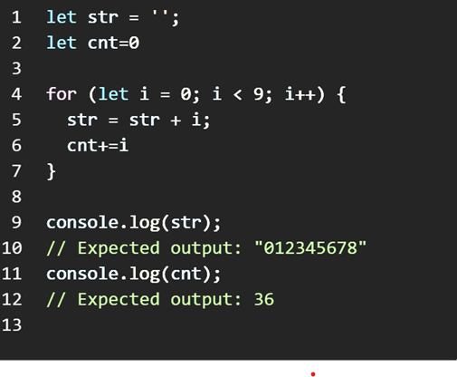

# `Что такой JavaScript`
## Javascript это популйарни язик програмирование . Тоист это язик интернета и йидинствини язик Frontent Разработчика 

 

# У JavaScripta много популйани библотеки !

# `РолЬ JavaScript в веп-разработке`

# `Краткая история JavaScript`
## JavaScript был создан компанией Netscape в 1995 году и быстро стал одним из самых популярных языков программирования благодаря своей простоте и широкому применению. JavaScript был создан Бренданом Эйком, который работал над разработкой языка, названного Mocha. Chrome, самый используемый интернет-браузер в 2017 году, настолько успешен отчасти из-за его способности быстро обрабатывать JavaScript.

# `РЕЛИЗЫ JAVASCRIPT`

# `Переменные и константы JavaScript`

## Что такой const
`JavaScript - это сокращение от “константа”. Короче говоря, const - это переменная, которая не может быть изменена после объявления. Кажется, это достаточно просто, не так ли? В константах есть несколько особенностей по сравнению с обычными переменными.`
 
 ___
 ## Что такой let
`Ключевое слово let в Javascript было введено в 2015 году в ES6. Так же, как и var в Javascript, ключевое слово let также используется для объявления переменной. `
 ___
 ## Что такой var
`   Ключевое слово var в JavaScript. В JavaScript var - это зарезервированное ключевое слово, за которым следует имя ссылочной переменной. Имя, определенное после ключевого слова, может затем использоваться в качестве указателя на данные в памяти. Использование var является старейшим методом объявления переменной в JavaScript.`

# `ОБЪЕКТЫ И ПРИМИТИВЫ`

## 7 примитивных типов данных

<btr>

# `Правила присвоения имен переменным JavaScript`
## Имена переменных должны начинаться либо с буквы, либо со знака подчеркивания _, либо со знака доллара $

 

# `Операторы В JavaScript`

## JavaScript содержит стандартный набор операторов, унаследованный от языков C++ и Java, а именно

# `Арифметические операторы JavaScript`

## Арифметические операторы в JavaScript — это символы, которые определяют математические операции и возвращают результат.

 

# `Три важные темы`

`1`  CONDITIONS  
`2`  LOOP  
`3` FUCKTION

# `Оператор CONDITION If/else !`
## Достаточно рассмотреть простой пример, чтобы понять, в чем заключается разница.

# `УСЛОВНЫЙ троичный оператор`
## Условный (троичный)оператор-единственный оператор JavaScript, который принимает три операнда:условие, за которым следует вопросительный знак (?), затем выражение для выполнения, если условие истинно, за которым следует двоеточие (:), и, наконец, выражение для выполнения, если условие ложно.

# `Состояние SWITCH условий`
## Это работает, потому что значение, которое мы присваиваем параметру switch, используется в качестве основы для сравнения. Следовательно, выражения case, также преобразуемые в логические значения, будут определять, какой case выполняется.

# `Цикл For `
## Оператор for создает цикл,состоящий из трех необязательных выражений,заключенных в круглые скобки и разделенных точкойсзапятой, за которыми следует оператор

# `Цикл WHILE `
## Оператор while создает цикл, которыйвыполняет указанную инструкцию до тех пор, покатестовое условие не примет значение true. Условие вычисляется перед выполнением инструкции.

# `Цикл DO/WHILE`
## Инструкция do...while создает цикл, который выполняет указанную инструкцию дотех пор, пока тестовое условие не примет значение false. Условие вычисляется после выполненияинструкции, в результате чего указанная инструкция выполняется по крайней мере один раз.

# `Функции !`
## Есть 3 способа написания функции на JavaScript

# `Что такой функции Declaration`
## Function Declaration – функция, объявленная в основном потоке кода. Function Expression – объявление функции в контексте какого-либо выражения, например присваивания

# `Что такой функции Expression`
## Function Expression – объявление функции в контексте какого-либо выражения, например присваивания.

# `Что такой функции IIFE`
## IIFE (Immediately Invoked Function Expression) — это конструкция, позволяющая вызывать функцию непосредственно после ее.

 
 

